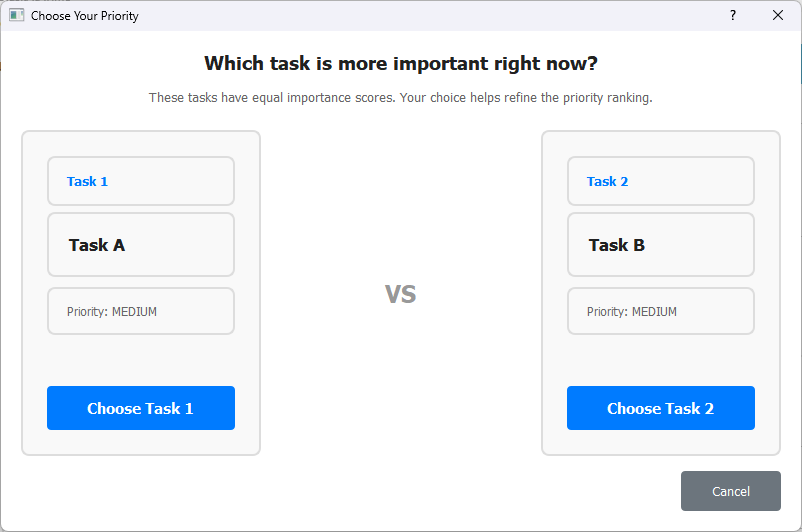
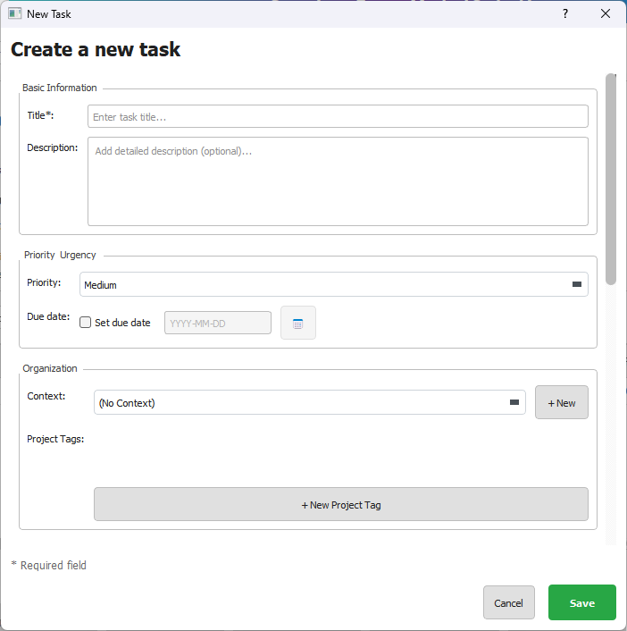
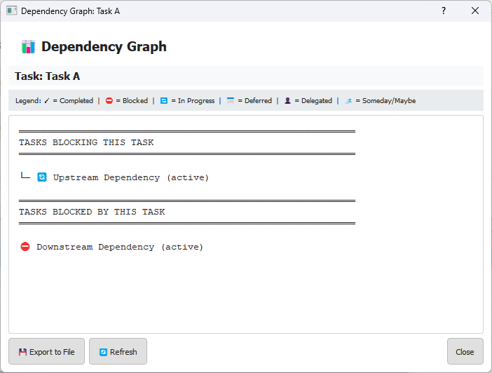
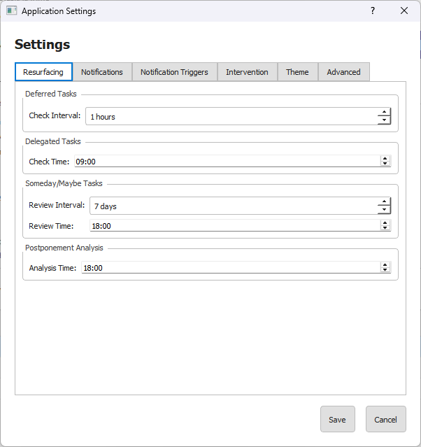
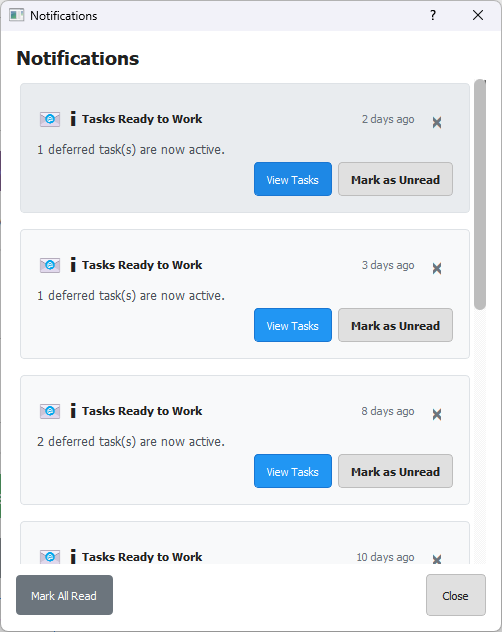

# OneTaskAtATime


**A focused, no-frills to-do list desktop application for Windows**

[](https://www.python.org/downloads/)
[](https://pypi.org/project/PyQt5/)
[](LICENSE)

Many users spend too much time managing task *lists*, when they should just pick a single task and execute it. The overarching goal of this app is to aid the user in focusing on one task.

⚠ **Warning (!!!)** ⚠ : **This project was vibe-coded (with love and care) using Claude Code. Do NOT assume that this code is bug-free... it very likely isn't. Use at your own risk!**

## Table of Contents

- [About the Project](#about-the-project)
- [Key Features & Screenshots](#key-features--screenshots)
- [Getting Started](#getting-started)
  - [Prerequisites](#prerequisites)
  - [Installation Options](#installation-options)
  - [Quick Start](#quick-start)
- [Usage](#usage)
  - [Basic Workflow](#basic-workflow)
  - [Key Keyboard Shortcuts](#key-keyboard-shortcuts)
- [Development](#development)
  - [Database Architecture](#database-architecture)
  - [Running Tests](#running-tests)
  - [Project Structure](#project-structure)

## About the Project

In David Allen's popular *"Getting Things Done"* (GTD) system, strong emphasis is placed on filtering a to-do list to determine the "Next Action" that is appropriate for your current working environment (referred to as "Context"). In theory, this makes perfect sense: it is well-known that "multitasking" is counter-productive, and therefore people should strive to focus on doing one thing at a time. Therefore, THE core feature of this app is a Focus Mode that presents the user with one task at a time, hence the app's name-sake.

Note: In a true dogmatic GTD system, a user would have an inbox for all of their informational inputs, which would then be sorted into Actionable Inputs and Non-Actionable Inputs. This is why many practitioners of GTD insist on incorporating their system into an email inbox or filing system. In my opinion, this sorting just adds an unnecessary step for most people. This app assumes that users are inputting actual tasks, not unsorted Inputs.

---

**Several usability problems need to be addressed in this app:**

1. **Problem/Background:** Many to-do apps allow users to rank priority and urgency in an attempt to enforce a logical order of presentation, but in practice users often end up with a lot of high-priority / high-urgency tasks, defeating the purpose of ranking tasks in the first place.

   **Proposed Solution:** The app resolves ties by presenting pairs of tasks with equal top-rank importance for comparison using an **Elo rating system**. When users compare two tasks, both tasks' Elo ratings are updated using the standard Elo formula. This rating is then mapped to an effective priority within strict bands based on the task's base priority tier.

   **Importance Calculation:**
   - **Effective Priority** = Elo rating mapped to band based on Base Priority
     - High (base=3): effective priority ∈ [2.0, 3.0]
     - Medium (base=2): effective priority ∈ [1.0, 2.0]
     - Low (base=1): effective priority ∈ [0.0, 1.0]
   - **Base Priority**: User-configurable 3-point scale (High = 3, Medium = 2, Low = 1)
   - **Elo Rating**: Standard Elo system (starts at 1500, typically ranges 1000-2000)
   - **Urgency**: Based on remaining days until due date (tasks with lowest day counts including overdue = 3, latest due date = 1)
   - **Importance** = Effective Priority × Urgency (max = 9)

   This system ensures that all High tasks rank above all Medium tasks, and all Medium tasks rank above all Low tasks, while Elo refines ranking within each tier. When Base Priority is changed, both Elo rating and comparison count reset to defaults. See [CLAUDE.md](CLAUDE.md) for complete algorithmic details.

2. **Problem/Background:** Tasks that are not immediately actionable or low-priority/low-urgency tend to end up in a purgatory state, left to rot and fester. GTD argues that these tasks should be sorted into the following states:
    - Deferred Tasks, which can only be completed after a specified Start Date
    - Delegated Tasks, which are assigned to another person and require a scheduled follow-up conversation (which in and of itself is a separate Deferred Task)
    - Someday/Maybe, for tasks that are not currently actionable, but *might* become actionable at an unknown date in the future
    - Trash, for tasks that the user deems unnecessary and which therefore should be removed from consideration

    The problem with this bucketing approach is that most apps fail to routinely resurface tasks in those buckets to the user.

    **Proposed Solution:** This app will attempt to fix that problem by resurfacing tasks in those buckets strategically.

3. **Problem/Background:** In attempting to execute the Next Action, GTD practitioners often find that their next task is comprised of multiple complex steps -- and therefore must be considered as a collection of tasks within a "Project". The heirarchy imposed can lead to difficulties with both prioritization and navigation, as tasks become buried within Projects, Phases, and ever-deeper levels of "organization". Task heirarchies add needless complexity and are detrimental to productivity.

   **Proposed Solution:** While there may be some value in tracking Projects as a form of tag meta-data (for filtering purposes), the structure of the master task list should be kept flat.Similarly, organizing tasks by work environment "Context" should also be done with tagging, rather than a hierarchy. A task may have only one Context, while a given Context may apply to as many tasks as the user desires.

4. **Problem/Background:** Tasks can also be difficult to complete due to various blockers and/or dependencies on other tasks. In failing to confront users when they delay a task, most to-do list apps fail to capture the user's reason for doing so.

   **Proposed Solution:** This app proposes to fix this problem by presenting users with prompts to explain their decision when they delay a task.
    - If a user responds (with a button) that a delayed task involves multiple subtasks, the interface should prompt them to enter those tasks, pick the Next Action and then delete the original task. Again, the goal here is to reduce task heirarchy.
    - If a user responds (with a button) that they encountered a blocker, the interface should prompt the user to create a new task to log and address that blocker.
    - If a user responds (with a button) that the task depends on completion of one or more tasks, the interface should prompt the user to choose or create the upstream task(s).

## Key Features & Screenshots

### Focus Mode - The Core Experience
*One task at a time, zero distractions.*


The heart of OneTaskAtATime: a clean, single-task view that eliminates choice paralysis. The app intelligently selects your most important task using the Elo-based importance ranking system (Priority × Urgency). Take action immediately with buttons for Complete, Defer, Delegate, Someday/Maybe, or Trash.

### Task List - Comprehensive Management
*Full control when you need it.*


Switch to Task List view (Ctrl+2) for comprehensive task management. View all tasks with sortable columns for importance, priority, due date, state, and more. Multi-select filtering by state and context tags helps you focus on relevant tasks.

### Priority Comparison - Intelligent Ranking
*Let the app learn your priorities.*



When multiple tasks have equal importance, the app presents side-by-side comparisons. Your choices update Elo ratings within strict base priority bands, ensuring High tasks always rank above Medium, and Medium above Low—while refining the order within each tier.

### Task Creation & Editing
*Capture every detail.*



Comprehensive task forms capture everything you need: description, notes, base priority, due date, start date (for deferral), contexts, project tags, and dependencies. The interface guides you through proper task definition while keeping the process quick and intuitive.

### Defer & Delegate Workflows
*Track dependencies and blockers.*


When you defer a task, the app asks why. Choose from multiple subtasks (break it down), encountered blocker (create a blocking task), or add dependencies. This captures critical information about what's holding you back and surfaces patterns over time.

### Dependency Visualization
*Understand task relationships.*



View task dependency chains in a clear tree structure. See which tasks block others, auto-detect circular dependencies before they become problems, and export graphs for documentation. Right-click any task with dependencies to explore the full chain.

### Settings & Customization
*Make it your own.*



Extensive customization options across 6 tabs: configure resurfacing intervals for deferred and delegated tasks, enable Windows toast notifications or in-app notification panel, choose light/dark themes with custom font sizes, and tune advanced Elo algorithm parameters.

### Resurfacing & Notifications
*Never lose track of important tasks.*



Background automation ensures deferred tasks activate on their start date, delegated tasks prompt follow-ups, and Someday/Maybe items get periodic reviews. Choose Windows native notifications, an in-app notification panel, or both. All intervals are user-configurable.

## Getting Started

### Prerequisites
- **Python 3.10 or higher** (for running from source)
- **Windows 10/11** (primary target platform)

### Installation Options

**Option 1: Windows Installer (Recommended)**

Download and run the latest `.exe` installer from the [Releases](https://github.com/cmdavis25/OneTaskAtATime/releases) page. The installer includes everything you need—no Python installation required.

For building your own installer, see [BUILD_INSTALLER.md](docs/user_guides/BUILD_INSTALLER.md).

**Option 2: Run from Source**

See detailed instructions in [INSTALLATION_GUIDE.md](docs/user_guides/INSTALLATION_GUIDE.md).

### Quick Start

**Running from Source:**

1. Clone this repository:
   ```bash
   git clone https://github.com/cmdavis25/OneTaskAtATime.git
   cd OneTaskAtATime
   ```

2. Run the automated setup script:
   ```bash
   setup.bat
   ```
   This creates a virtual environment and installs all dependencies.

3. Activate the environment and launch the app:
   ```bash
   onetask_env\Scripts\activate
   python -m src.main
   ```

**First-Time Users:**

On first launch, the app creates an empty database. To explore features with sample data, run:
```bash
python -m src.database.seed_data
```

For detailed setup instructions, troubleshooting, and manual installation, see [INSTALLATION_GUIDE.md](INSTALLATION_GUIDE.md).

## Usage

### Basic Workflow

1. **Start in Focus Mode**: The app opens to Focus Mode, showing your most important task
2. **Take Action**: Click Complete when done, or defer/delegate/postpone as needed
3. **Add Tasks**: Press Ctrl+N to create new tasks with priority, due date, and tags
4. **Manage Tasks**: Switch to Task List (Ctrl+2) for full task management
5. **Compare Priorities**: When ties occur, the app prompts you to compare tasks side-by-side
6. **Review Regularly**: The app automatically reminds you about deferred and delegated tasks

### Key Keyboard Shortcuts

- **Ctrl+N**: New Task
- **Ctrl+1**: Switch to Focus Mode
- **Ctrl+2**: Switch to Task List
- **Ctrl+F**: Search Tasks
- **Ctrl+,**: Open Settings
- **Ctrl+Shift+E**: Export Data
- **Ctrl+Shift+I**: Import Data
- **Ctrl+Shift+A**: Postpone Analytics
- **Ctrl+?**: Show All Shortcuts
- **F1**: Help Contents
- **F5**: Refresh

For comprehensive usage instructions, see [USER_GUIDE.md](docs/user_guides/USER_GUIDE.md).

## Development

### Database Architecture

The application uses an **SQLite database** with **8 tables** that work together to support the GTD-inspired workflow:

**Core Entities:**
- **tasks** - Main task storage with priority system, urgency tracking, and state management
- **contexts** - Work environment filters (@computer, @phone, @errands, etc.)
- **project_tags** - Flat project organization using tags (no hierarchies)

**Relationships & History:**
- **task_project_tags** - Many-to-many junction for tasks and projects
- **dependencies** - Task blocker tracking with circular dependency prevention
- **task_comparisons** - History of priority adjustments from user comparisons
- **postpone_history** - Tracks when/why tasks were delayed to surface blockers
- **settings** - Type-safe application configuration storage

**Key Features:**
- Importance scoring: `effective_priority × urgency_score` (effective priority calculated from Elo rating)
- Elo-based comparison system within base priority bands
- Automatic resurfacing of deferred, delegated, and someday tasks
- Circular dependency detection using depth-first search
- 12 strategic indexes for query performance

See [database_explanation.md](docs/user_guides/database_explanation.md) for complete schema details, relationship diagrams, and data flow examples.

### Running Tests

```bash
# Activate virtual environment
onetask_env\Scripts\activate
```
```bash
# Run all tests with coverage
pytest
```
```bash
# Run specific test categories
pytest -m unit          # Unit tests only
```
```bash
pytest -m integration   # Integration tests only
```
```bash
pytest -m ui            # UI tests only
```

### Project Structure

```
OneTaskAtATime/
├── src/                    # Application source code
│   ├── main.py            # Entry point
│   ├── models/            # Data models
│   ├── database/          # SQLite DAOs and schema
│   ├── algorithms/        # Priority, ranking, resurfacing
│   ├── ui/                # PyQt5 widgets and dialogs
│   ├── services/          # Business logic services
│   └── utils/             # Helper functions
├── tests/                 # Test suite
├── resources/             # Database and assets
└── requirements.txt       # Python dependencies
```
